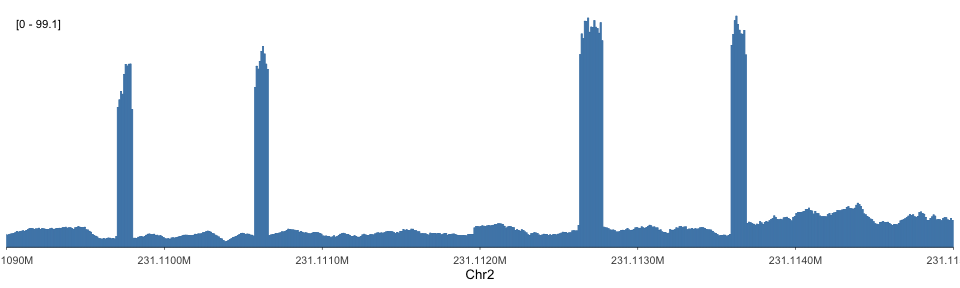
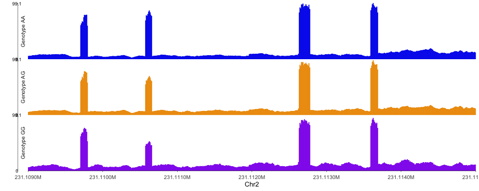

<!-- index.md is generated from index.Rmd. Please edit that file -->

# ezGenomeTracks

**Minimal, ggplot2-based genome browser tracks for R**

[](https://lifecycle.r-lib.org/articles/stages.html#experimental)
[](https://opensource.org/licenses/MIT)

------------------------------------------------------------------------

ezGenomeTracks makes it easy to create publication-quality genomic
visualizations with minimal code. Built entirely on ggplot2, it provides
both high-level `ez_*()` wrappers for quick plotting and low-level
`geom_*()` layers for full customization.

## Installation

``` r
# Install from GitHub
# install.packages("devtools")
devtools::install_github("Zepeng-Mu/ezGenomeTracks")
```

## Quick Example

``` r
library(ezGenomeTracks)

# Define a genomic region
region <- "chr2:231109000-231115000"

# Load example signal data
bw_file <- system.file(
  "extdata",
  "avg_chr2-231091223_231109786_231113600_0.bw",
  package = "ezGenomeTracks"
)

# Create a coverage track in one line
ez_coverage(
  bw_file,
  region = region,
  colors = "steelblue",
  y_axis_style = "simple"
)
```



## Track Types at a Glance

ezGenomeTracks supports **7 track types** covering the most common
genomic visualization needs:

| Track Type    | Function         | Use Case                            |
|---------------|------------------|-------------------------------------|
| **Coverage**  | `ez_coverage()`  | ChIP-seq, ATAC-seq, RNA-seq signal  |
| **Gene**      | `ez_gene()`      | Gene models with exons/introns      |
| **Feature**   | `ez_feature()`   | Peaks, enhancers, any BED intervals |
| **Link/Arc**  | `ez_link()`      | Chromatin loops, interactions       |
| **Sashimi**   | `ez_sashimi()`   | RNA-seq splice junctions            |
| **Manhattan** | `ez_manhattan()` | GWAS association plots              |
| **Hi-C**      | `ez_hic()`       | Contact matrices, TADs              |

## Design Philosophy

### Easy Wrappers + Powerful Geoms

**For quick plots**, use `ez_*()` functions that handle data import,
theming, and scaling automatically:

``` r
# One line from file to plot
ez_coverage("signal.bw", region = "chr1:1000000-2000000")
```

**For full control**, use `geom_*()` layers like any ggplot2 geom:

``` r
ggplot(my_data) +
  geom_coverage(aes(fill = sample)) +
  scale_x_genome_region(region) +
  facet_wrap(~condition)
```

### Vertical Stacking with Shared X-Axis

Combine multiple tracks into a single figure with `vstack_plot()`:

``` r
vstack_plot(
  ez_coverage(signal_file, region),
  ez_gene(txdb, region),
  ez_feature(peaks_file, region),
  region = region,
  heights = c(2, 1, 0.5)
)
```

## Feature Highlights

- **Flexible input**: File paths, data frames, GRanges, or named lists
- **Automatic scaling**: Genomic coordinates formatted as kb/Mb
- **Multi-track support**: Faceted or overlapping tracks from lists
- **Publication themes**: Clean, minimal defaults with `ez_*_theme()`
  functions
- **Full ggplot2 compatibility**: Add any ggplot2 layer or theme

## Comparing Samples

Easily visualize multiple samples as stacked or overlapping tracks:

``` r
# Load multiple bigWig files
bw_files <- list(
  "Genotype AA" = system.file("extdata", "avg_chr2-231091223_231109786_231113600_0.bw", package = "ezGenomeTracks"),
  "Genotype AG" = system.file("extdata", "avg_chr2-231091223_231109786_231113600_1.bw", package = "ezGenomeTracks"),
  "Genotype GG" = system.file("extdata", "avg_chr2-231091223_231109786_231113600_2.bw", package = "ezGenomeTracks")
)

# Stacked view (faceted)
ez_coverage(
  bw_files,
  region = "chr2:231109000-231115000",
  colors = c("blue2", "orange2", "purple2"),
  y_axis_style = "minmax",
  facet_label_position = "left"
)
```



## Learn More

- [Get Started](articles/get_started.html) - Core concepts and design
  principles
- [Coverage Track](articles/tracks_coverage.html) - Signal visualization
- [Gene Track](articles/tracks_gene.html) - Gene model annotation
- [Manhattan Track](articles/tracks_manhattan.html) - GWAS visualization
- [Sashimi Track](articles/tracks_sashimi.html) - Splice junction plots
- [Function Reference](reference/index.html) - Complete API
  documentation

## Citation

If ezGenomeTracks aids your research, please cite the GitHub repository
in your methods section.

## License

MIT License
